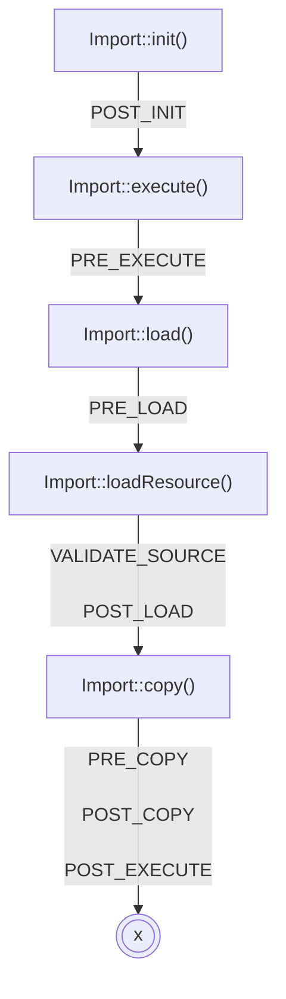

# Process

## Init

Called by `Import::init()`. Loads and validates the configuration file.

## Exec

Import::execute()`. Loads and copies resources.

## Load

Loops over each loadable resource and loads their data into temporary tables.

## Copy

Loops over each copyable resource and copies their data from the temporary tables to the target tables.