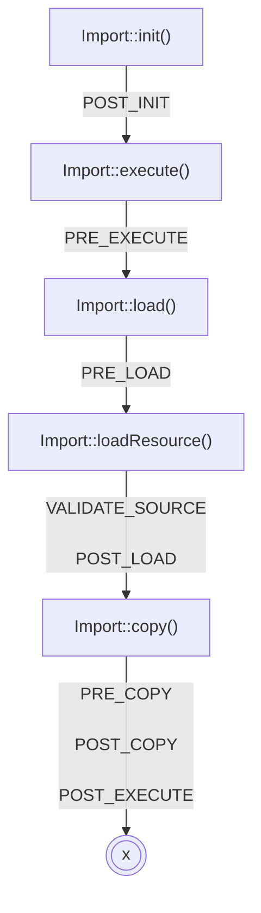

# Processus d'exécution

## Initialisation

Appelé par `Import::init()`. Charge et valide le fichier de configuration.

## Exécution

`Import::execute()`. Charge et copie les ressources.

## Chargement

Boucle sur chaque ressource chargeable et charge leurs données dans des tables temporaires.

## Copie

Boucle sur chaque ressource copiable et copie leurs données des tables temporaires vers les tables cibles.